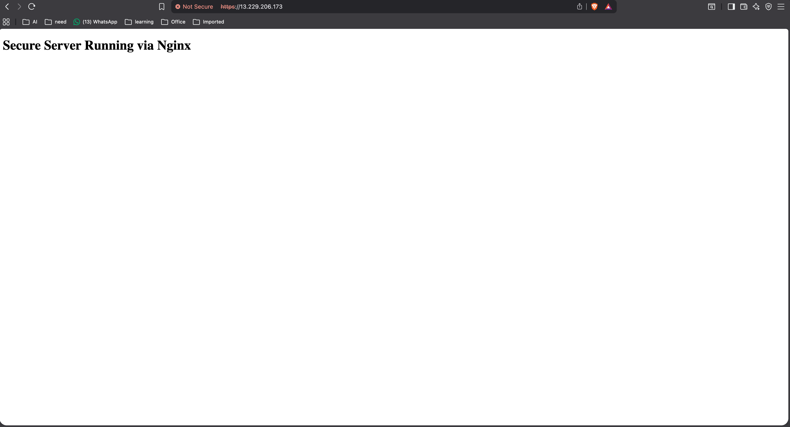
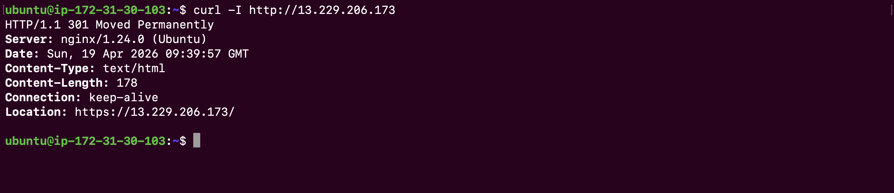
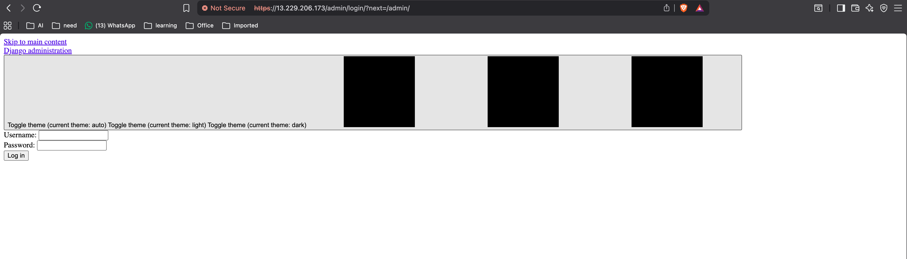

# Nginx Web Server with HTTPS, SSL & Reverse Proxy
 
## Overview
A secure production-like web server setup using Nginx on Linux (Ubuntu 24) with:
- Static website hosting
- HTTPS using self-signed SSL (OpenSSL)
- HTTP → HTTPS auto redirect
- Reverse proxy to Django backend (port 3000)
---
 
## All Commands
 
### Part 1: Install Nginx & OpenSSL
```bash
sudo apt update && sudo apt upgrade -y
sudo apt install nginx openssl -y
 
# Create web directory
sudo mkdir -p /var/www/secure-app
sudo nano /var/www/secure-app/index.html
 
# Set permissions
sudo chown -R www-data:www-data /var/www/secure-app
sudo chmod -R 755 /var/www/secure-app
```
 
### Part 2: Generate Self-Signed SSL (365 days)
```bash
sudo mkdir -p /etc/nginx/ssl
 
sudo openssl req -x509 -nodes -days 365 -newkey rsa:2048 \
  -keyout /etc/nginx/ssl/selfsigned.key \
  -out /etc/nginx/ssl/selfsigned.crt
```
 
### Part 3: Nginx Config
```bash
# Disable default config
sudo rm /etc/nginx/sites-enabled/default
 
# Create custom config
sudo nano /etc/nginx/sites-available/secure-app
 
# Enable config
sudo ln -s /etc/nginx/sites-available/secure-app /etc/nginx/sites-enabled/
 
# Test and reload
sudo nginx -t
sudo systemctl reload nginx
```
 
### Part 4: Run Django Backend
```bash
cd ~/os-third-assignment
source venv/bin/activate
python manage.py migrate
python manage.py runserver 0.0.0.0:3000 &
```
 
### Part 5: Testing
```bash
# Test config
sudo nginx -t
 
# Reload Nginx
sudo systemctl reload nginx
 
# Test HTTP → HTTPS redirect
curl -I http://13.229.206.173
 
# Test HTTPS
curl -k https://13.229.206.173
 
# Test backend via Nginx
curl -k https://13.229.206.173/admin/
```
 
---
 
## Nginx Config
 
```nginx
# HTTP → HTTPS redirect
server {
    listen 80;
    server_name _;
 
    return 301 https://$host$request_uri;
}
 
# HTTPS server
server {
    listen 443 ssl;
    server_name _;
 
    ssl_certificate     /etc/nginx/ssl/selfsigned.crt;
    ssl_certificate_key /etc/nginx/ssl/selfsigned.key;
 
    root /var/www/secure-app;
    index index.html;
 
    # Static site
    location / {
        try_files $uri $uri/ =404;
    }
 
    # Reverse proxy to Django backend
    location /admin/ {
        proxy_pass http://127.0.0.1:3000;
 
        proxy_set_header Host $host;
        proxy_set_header X-Real-IP $remote_addr;
        proxy_set_header X-Forwarded-For $proxy_add_x_forwarded_for;
        proxy_set_header X-Forwarded-Proto $scheme;
    }
}
```
 
---
 
## SSL Command
 
```bash
sudo openssl req -x509 -nodes -days 365 -newkey rsa:2048 \
  -keyout /etc/nginx/ssl/selfsigned.key \
  -out /etc/nginx/ssl/selfsigned.crt
```
 
---
 
## Screenshots
 
### 1. HTTPS Working

 
### 2. HTTP → HTTPS Redirect Working

 
### 3. Backend Running via Reverse Proxy

 
---
 
## Note on SSL Warning
This project uses a **self-signed SSL certificate** generated with OpenSSL.
Browsers will show a "Not Secure" warning because it is not issued by a
trusted Certificate Authority (CA). This is expected for development/assignment
purposes. In production, use Let's Encrypt (Certbot) for a trusted certificate.
 
---
 
## Architecture
 
```
User → HTTP:80 → Nginx → 301 redirect → HTTPS:443
User → HTTPS:443 → Nginx → serves /var/www/secure-app/index.html
User → HTTPS:443/admin/ → Nginx → Django:3000
```
